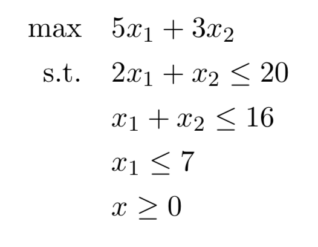

# GILP

[](https://lbesson.mit-license.org/)
[](https://pypi.python.org/pypi/gilp/)
[](https://gilp.readthedocs.io/en/latest/?badge=latest)
[](https://github.com/henryrobbins/gilp)
[](https://pypi.python.org/pypi/gilp/)

GILP (Geometric Interpretation of Linear Programs) is a Python package for
visualizing the geometry of [linear programs](https://en.wikipedia.org/wiki/Linear_programming) (LPs) and the [simplex algorithm](https://en.wikipedia.org/wiki/Simplex_algorithm). LPs can be constructed from NumPy arrays and many examples
(such as the [Klee-Minty cube](https://en.wikipedia.org/wiki/Klee%E2%80%93Minty_cube))
are included. The revised simplex method is implemented along with various pivot
rules (such as [Bland's](https://en.wikipedia.org/wiki/Bland%27s_rule)
and Dantzig's). Additionally, an initial feasible solution and iteration limit
may be set. The package relies on [Plotly](https://plotly.com/python/) to generate standalone HTML files which can be viewed in a Jupyter
Notebook inline or in a web browser.


## Installation

The quickest way to get started is with a pip install.

```bash
pip install gilp
```

## Development

To develop and run tests on gilp, first download the source code in the desired
directory.

```bash
git clone https://github.com/henryrobbins/gilp
```

Next, cd into the gilp directory and create a Python virtual enviroment.

```bash
cd gilp
python -m venv env_name
```

Activate the virtual enviroment.

```bash
source env_name/bin/activate
```

Run the following in the virtual enviroment. The ```-e``` flag lets you make
adjustments to the source code and see changes without re-installing. The
```[dev]``` installs necessary dependencies for developing and testing.

```bash
pip install -e .[dev]
```

To run tests and see coverage, run the following in the virtual enviroment.

```bash
coverage run -m pytest
coverage report --include=gilp/*
```

## Usage

The LP class creates linear programs from (3) NumPy arrays: A, b, and c which define the LP in standard inequality form.


For example, consider the following LP:



The LP instance is created as follows.

```python
from gilp.simplex import LP

A = np.array([[2, 1],
              [1, 1],
              [1, 0]])
b = np.array([[20],
              [16],
              [7]])
c = np.array([[5],
              [3]])
lp = LP(A,b,c)
```

After creating an LP, one can run simplex and generate a visualization with

```python
from gilp.visualize import simplex_visual
simplex_visual(lp)
```

where ```simplex_visual()``` returns a plotly figure. The figure can then be
viewed on a Jupyter Notebook inline using

```python
simplex_visual(lp).show()
```

If ```.show()``` is run outside a Jupyter Notebook enviroment, the visualization
will open up in the browser. Alternatively, the HTML file can be written and then
opened.

```python
simplex_visual(lp).write_html('name.html')
```

Below is the visualization for the example LP. The plot on the left shows the
feasible region and constraints of the LP. Hovering over an extreme point shows
the basic feasible solution, basis, and objective value. The iteration slider
allows one to toggle through the iterations of simplex and see the updating
tableaus. The objective slider lets one see the objective line or plane for
some range of objective values.


## License

Licensed under the [MIT License](https://choosealicense.com/licenses/mit/)

