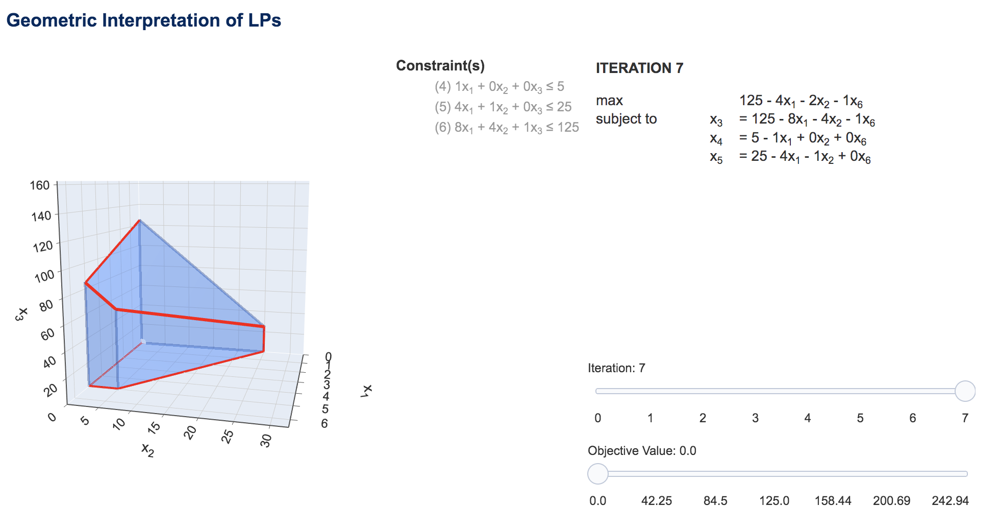

.. GILP documentation master file, created by
   sphinx-quickstart on Wed Jul 15 11:28:42 2020.
   You can adapt this file completely to your liking, but it should at least
   contain the root `toctree` directive.

Visualizing Linear Programs with GILP
=====================================

GILP (Geometric Interpretation of Linear Programs) is a Python package for
visualizing the geometry of `linear programs <https://en.wikipedia.org/wiki
/Linear_programming>`_ (LPs) and the `simplex algorithm <https://
en.wikipedia.org/wiki/Simplex_algorithm>`_. The package relies on
`Plotly <https://plotly.com/python/>`_ for generating visualizations. It is
recommended to start with the :ref:`quick` which includes installation
instructions and a tutorial. If you are interested in developing on GILP, see
:ref:`dev`. Lastly, this page includes the full :ref:`docs`.

.. toctree::
   :maxdepth: 2
   :caption: Contents:

   quickstart_guide/index
   development/index
   examples/index
   modules
